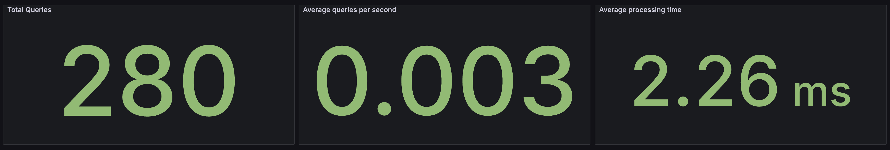
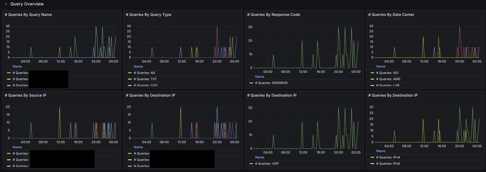
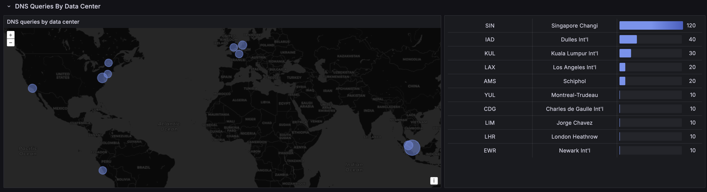
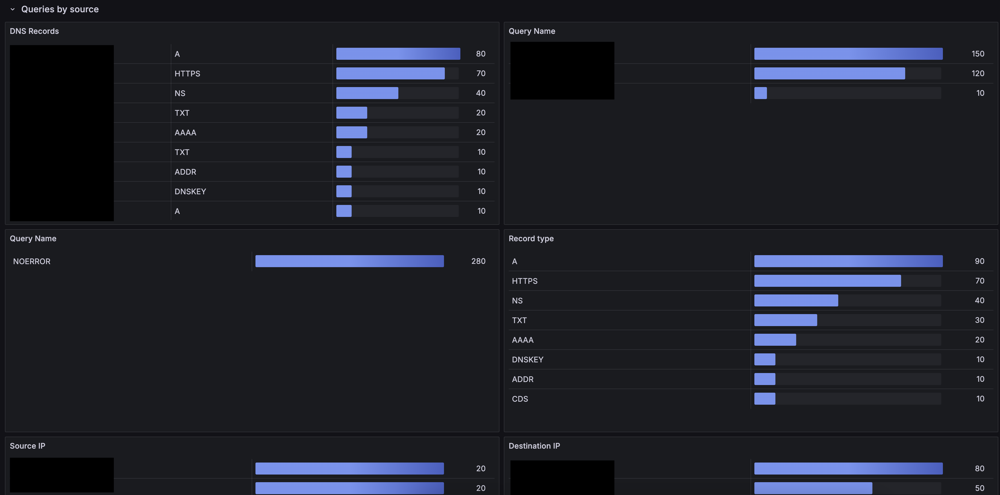

## Overview

This is a replication of the Cloudflare's built in [DNS Analytics Dashboard](https://developers.cloudflare.com/dns/additional-options/analytics/)

The dashboard is also published on [Grafana Community](https://grafana.com/grafana/dashboards/22568-cloudflare-dns-analytics/)

## Screenshots

## Configuration

This dashboard uses [infinity](https://grafana.com/grafana/plugins/yesoreyeram-infinity-datasource/) as datasource. Install the plugin by going to "Connections" -> "Add New Connection" and search for infinity. 

Add new infinity datasource and configure as below:
- Get a Cloudflare api key, follow this [link](https://developers.cloudflare.com/analytics/graphql-api/getting-started/authentication/api-token-auth/) for guide. For token permission, choose Zone, analytics, read. 
- In infinity configuration, choose "Authentication" -> "Bearer Token" and paste the token from Cloudflare.
- In "Security" -> "Allowed Hosts", add `https://api.cloudflare.com/client/v4/graphql` and `https://api.cloudflare.com/client/v4/user/tokens/verify`
- (Optional) In "Healthcheck", check enable, enter `https://api.cloudflare.com/client/v4/user/tokens/verify` as url

Proceed to import the dashboard
- Select the configured infinity datasource 
- Enter the zone id in the text box for the zone you wish to monitor 
- For guide on how to get zone id, refer this [link](https://developers.cloudflare.com/fundamentals/setup/find-account-and-zone-ids/)